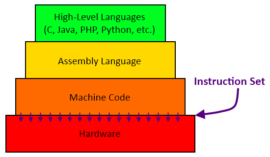

# NodeJS Intro

# Topics
- What is NodeJS?
- Diving deeper into Programming Languages
- Google's Javascript Engine: V8
- Installing & running your first NodeJS code

# Lesson

## What is NodeJS?

### Why not just call it Javascript for Server?

If we go to the NodeJS (Node, for short) [website](https://nodejs.org/en/) we get the following definition:

```
Node.js® is a JavaScript runtime built on Chrome's V8 JavaScript engine.
```

At first glance that is a very confusing and technical description of what NodeJS really is. This lesson we will go through these technical concepts and finally run our first NodeJS code!

We will also understand why it's different from browser based Javascript we've been working with so far.

## Diving deeper into Programming Languages

### How does a computer program work?


In all our computers, whether they be desktop computers, laptops, or mobile phones, are these very smartly designed microprocessor chips. These are the brains behind your computer and they are the ones that do all the calculations, interpretations and logic for your computer.

Essentially, your machine only understands 1s and 0s. You may ask then how do we code in Javascript and have the computer understand? That's a very good question!

### Higher Level Programming Languages

Your computer only understands Binary code. This means only 1s and 0s are processed by our processors. But we obviously can't code or read binary code easily, so that's why in the 1950s we developed 'Higher Level Programming Languages'. 

These languages are C, Fortran, PASCAL and C++ to name a few. These languages are directly "compiled" into the Binary machine code our computers understand.

Your operating system is basically a computer program that is written in one of these languages. 



### Interpreted Languages

Now, where does Javascript fit into all this? Does our Javascript code compile to binary? Unfortunately, it does not. 

Javascript was developed in the 1990s to add interactions to websites. Your Web browser is just a computer program. It had to be written by someone using a High Level Programming Language. 

It's a special type of program that does the following:

1. Make network requests to the Internet and retrieve data.
2. Interpret and display the data it recieves.

**Javascript, HTML and CSS are all *interpreted* by your web browser on the fly.**

Javascript ONLY works if a computer program such as a Web browser interprets it. 

## Google's Javascript Engine: V8

### Chrome's Javascript Interpreter 

Let's take a look at the official Chrome V8 website: [https://developers.google.com/v8/](https://developers.google.com/v8/)

```
V8 is Google’s open source high-performance JavaScript engine, written in C++ and used in Google Chrome, the open source browser from Google, and in Node.js, among others. It implements ECMAScript as specified in ECMA-262, and runs on Windows 7 or later, macOS 10.5+, and Linux systems that use IA-32, ARM, or MIPS processors. V8 can run standalone, or can be embedded into any C++ application. More information can be found on V8's public wiki.
```

This is basically Google's open source engine that runs and interprets Javascript on all our Google Chrome web browsers.

The very smart people at Google then thought: What if we just run this standalone without a browser on a computer? That's how NodeJS was born.

### NodeJS Environment

A web server is just a computer serving data on the internet.

Google decided, with it's V8 Javascript Engine, it's possible to serve webpages, connect to databases, manage files all on the server side.

### NodeJS: Addons to Javascript

Stand alone Javascript on the browser does not have a lot of the capabilities we need to handle Server Side programming.

NodeJS includes many new libraries and tools to allow us to do the following:

1. Input/Output Buffers: Handle binary data 
2. File System: Manage file system on your machine
3. HTTP Networking: Allows you to handle requests and responses
4. Streams and Pipes: Allows you to handle data in chunks as it comes in. (Example: Video streaming)
5. Access to the Operating System

These are some of many new things you can do with Javascript in the NodeJS environment. Essentially, now Javascript can directly interface with your machine thanks to the V8 Engine.

## Running NodeJS

### Installing Node on your computer

#### Option 1: Direct Install Through NodeJS Website

You can head over to [https://nodejs.org/en/download/](https://nodejs.org/en/download/) to use the NodeJS official installer for your operating system. 

#### Option 2: Homebrew

On the Mac you can use Homebrew to manage your installation.

Paste this into your Terminal and run it:
```
/usr/bin/ruby -e "$(curl -fsSL https://raw.githubusercontent.com/Homebrew/install/master/install)"
```

Then after enter:

```
>> brew install node
```

### After Installing

After installation go to your console and try the following command:

```
>> node --version
v9.10.0
```

If you get this that means your installation was successful.

### Running Javascript files on your computer

Now because we have NodeJS installed correctly, we can finally run code from our computer.

Let's create a file called 'app.js' and then add the following code:

```javascript
console.log("Hello World!");
console.log("Welcome to your first NodeJS program!");
```

If we then go to our console/terminal and run the following command:

```
>> node app.js
```

We will get the following response!

```javascript
Hello World!
Welcome to your first NodeJS program!
```

Congrats on running your first NodeJS code!